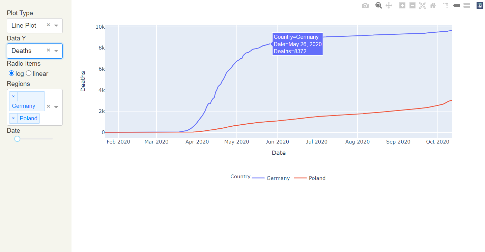
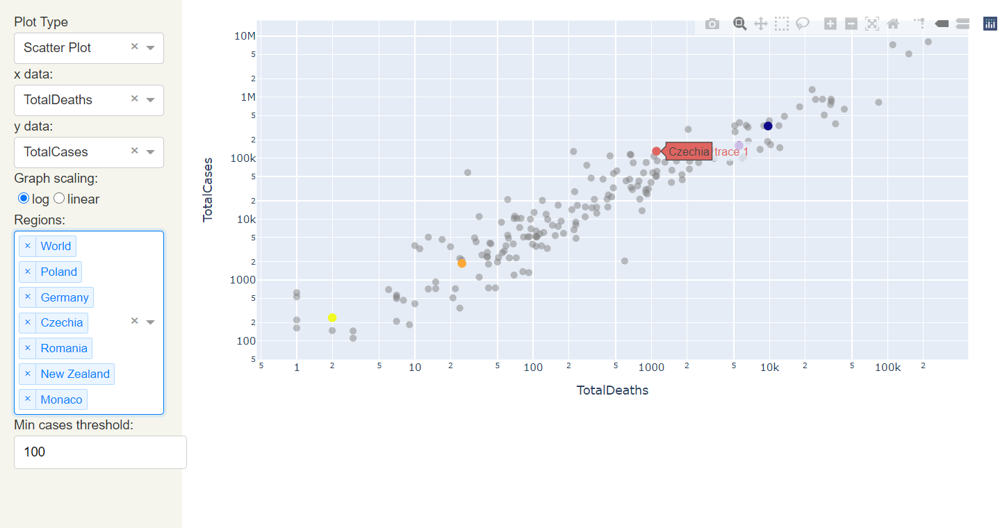

# Dashboard 📈
--------------------
Scraping data concerning COVID reported cases and deaths from websites and presenting them as an interactive Python Dash dashboard.
Inspired by this <a href="https://github.com/momonala/covid-19"> great project</a>.


Sources used:
<a href="https://www.worldometers.info/">worldometers.info/</a>
<a href="https://github.com/CSSEGISandData/COVID-19"> John's Hopkins University Data</a>


## Examples:

<p align="center">




</p>

---------------------------

## Usage:

To examine the results of literature clustering, copy the repository, open your console (cmd) in folder named `Dashboard` and run:

``` py dashboard.py ```

For the most recent and updated results.