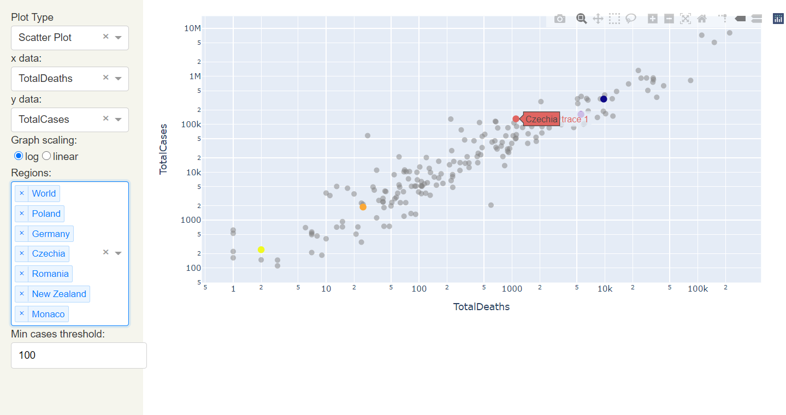

# COVID-19 projects 🦠
--------------------
1. **Literature clustering** - Kaggle challenge concerning COVID-19.
2. **Dashboard** - Scraping data concerning COVID reported cases and deaths from websites and presenting them as an interactive dashboard.
3. **Social Distancing** - Detecting with YOLO whether the minimal safe distance between two persons is being kept.
4. **Mask detector** - Realtime camera detecting whether a particular person is wearing a mask or not.

**Find more details in each folder with the right name.**

Tools used:
- Kaggle's scrapped articles and datasets
- Tensorflow
- Nltk
- Pandas
- Json
- Pycountry
- Allcities
- Spacy
- BeautifulSoup4
- Selenium
- OpenCV
- Imutils

